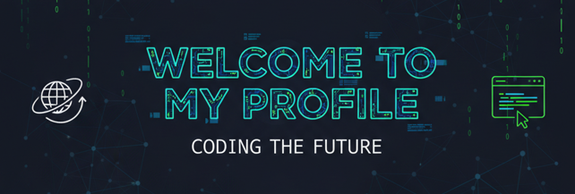

 
# Hello! My name is Gulfam Hashmi
----
> ### My motivation to work is: "Just sit and work"

----
# Table of contents:
* [About Me](#-about-me)
* [Skills](#-skills)
* [My GitHub Repositories](#-my-github-repositories)
* [Goals & Checklist](#-goals--checklist)
* [Contact Me](#-contact-me)
----
# About me
**Name:** Gulfam Hsahmi

**University:** Punjab University of Information and Technology, New Campus, Lahore, Paskistan

**About me:** I am soon to be DATA SCIENCE. Working on my projects to get maximum experience. This readme.md is going to update a lot of times.

## Interest and Goals:

* Exploring the insights of **DSA** and **DATA ANALYTICS**
* My interst is in **DATA VISUALIZATION** and **Cloud Computing**

----
# Skills
* **Programming Languages:** JS,CSS,HTML,C++,PYTHON
* **Web Development:** Frontened
------
### Tools & Platforms
| Category | Skills |
| :--- | :--- |
| **Social** | Linkden|
| **Tools** | Git, Kaggle, VS Code|
-----
# 📂 My GitHub Repositories
> This section showcases my accidental works
 * [**Welcom to Lahore:**](https://github.com/Gulfam-Hashmi/Welcome-to-Lahore) My first Frontend project which is user friendly and guide for the foreigner tourists.
 * [**DSA LAB:**](https://github.com/Gulfam-Hashmi/DSA-Labs) This is my ongoing repository in which I uploade the Weekly DSA LAB in our university.
 * [**Important Class:**](https://github.com/Gulfam-Hashmi/Stack_class) During DSA i have to make some classes like QUEUE,STACK and LINKED LISTS which is used again and again in different tasks.
 * [**Car_price_pridiction:**]((https://github.com/Gulfam-Hashmi/Car_price_pridiction)) In my IDS course, I tried to perform linear regression on set of data to predict the prices of cars with differenct feature.
 * [**pandas_pro_chatbot:**]((https://github.com/Gulfam-Hashmi/pandas_pro_chatbot)) Just a little experiments with AI,LLMS where created a chatbot using AI to teach me pandas or deal with any queries related to this.

 ----
 # 📝 Goals & Checklist
### Current Learning Focus
* [x] Learned markdown
* [ ] Completing DSA
* [ ] Completing **Coursera** data analytics course
---
 # Contact Me
 * 📧 **Email:** gulfamsattar000@gmail.com
* 🔗 **LinkedIn:** [Gulfam Hashmi](https://www.linkedin.com/in/gulfam-hashmi-6100b136b/)
* 📊 **Kaggle:** [Gulfam Hsahmi](https://www.kaggle.com/gulfamhashmi)

